<div align="center">

# 🎵 Playnck

**A native-feeling, self-healing music player for people who actually care about their local library.**

Built with Electron. Writes real ID3/metadata back to your files. Fingerprints and auto-tags your unsorted MP3s. Ten-band EQ. Synced lyrics. Seventy-two theme combinations. Zero cloud, zero accounts, zero nonsense.

[](https://github.com/FakharArrazi/Project-Playnck/releases/latest)
[](https://github.com/FakharArrazi/Project-Playnck/releases)


[](#-license)

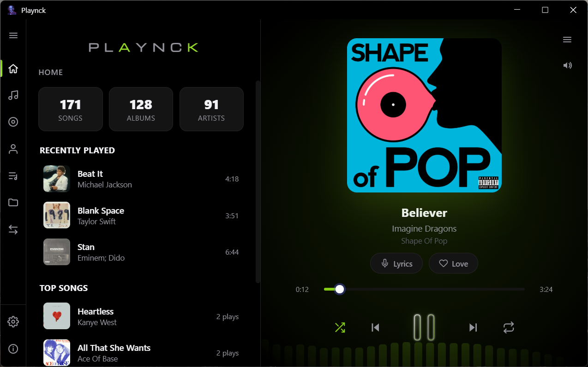

</div>

---

## ✨ Features

### 🎧 Playback & library
- Plays MP3, WAV, FLAC, OGG, M4A/AAC, and Opus straight from disk — no import/transcode step, no library database bloat.
- Audio is streamed through a custom `playnck-file://` Electron protocol with proper HTTP `Range` / `206 Partial Content` support, so seeking is instant even on long tracks.
- **Self-healing library**: on launch and on demand, Playnck checks every track path against the disk and quietly prunes anything that's been moved, renamed outside the app, or deleted — no dead entries, no manual "clean up library" step.
- **Watched folders** are re-scanned automatically to pick up newly added files and drop ones that disappeared.
- Drag-and-drop files or whole folders straight into the window to add them.
- Deleting a track from Playnck sends the real file to the **Windows Recycle Bin** — never a hard delete.
- Shuffle with real history (going "previous" during shuffle retraces what you actually played, not a random jump), plus off/one/all repeat modes.
- Gapless-style crossfade between tracks (~3 seconds) so the player never leaves a dead silence gap on the last few seconds of a song.

<p align="center">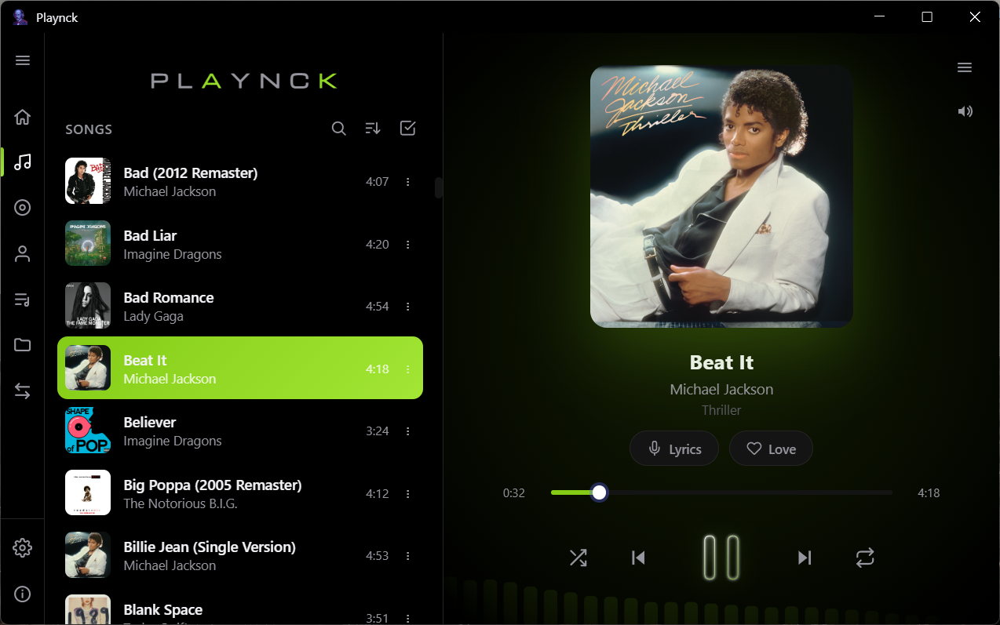</p>

### 🏠 Home dashboard
- Library stats at a glance, a **Recently Played** rail, and a **Top Songs** list ranked by real play count.
- Play counts only increment after a track has actually played for **30 seconds** — skips and accidental clicks don't inflate your stats.

### 🗂️ Organize your way
- Dedicated tabs for **Songs, Albums, Artists, Playlists, and Folders**, each with its own sort order.
- Multi-select across every tab (songs, albums, artists, playlists, folders) for bulk actions.
- Create playlists and **export them as standard `.m3u`** files that other players can read.
- Fast, debounced live search that filters whichever tab you're on.

<table align="center">
<tr>
<td>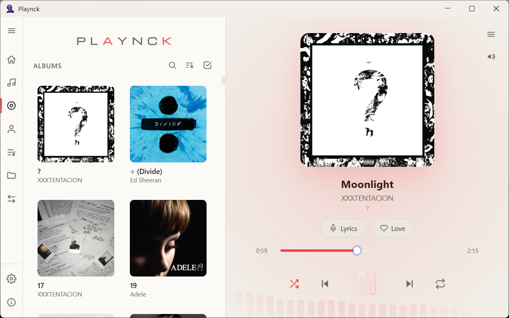</td>
<td>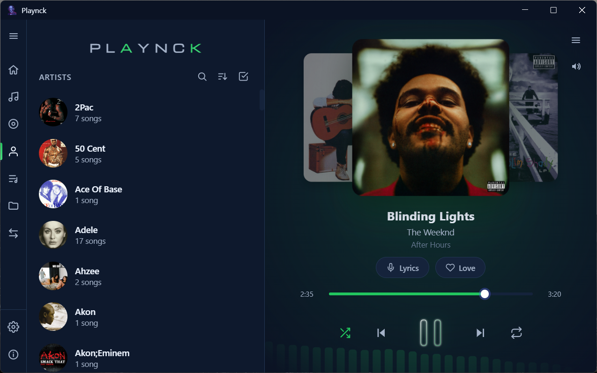</td>
</tr>
<tr>
<td>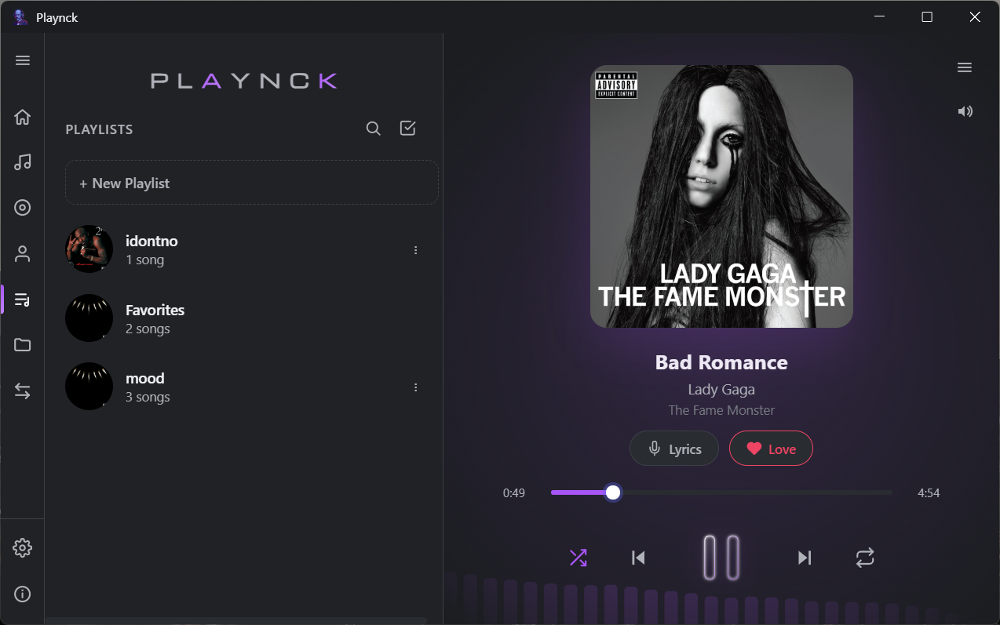</td>
<td>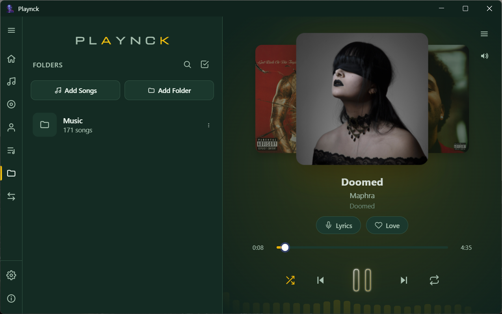</td>
</tr>
</table>

### 🎚️ A real audio engine, not just an `<audio>` tag
- **10-band graphic equalizer** (32 Hz → 16 kHz) built on the Web Audio API with live `BiquadFilterNode` chaining, ±12 dB per band.
- One-click presets: **Flat, Bass Boost, Treble Boost, Vocal Boost** — or drag your own curve.
- **Gapless playback**: a short automatic crossfade smooths the transition between songs instead of a hard cut (skipped on repeat-one).
- A live, reactive **frequency visualizer** rendered on canvas that pulls its color directly from your active theme's accent, with an adjustable intensity/opacity slider.

<p align="center">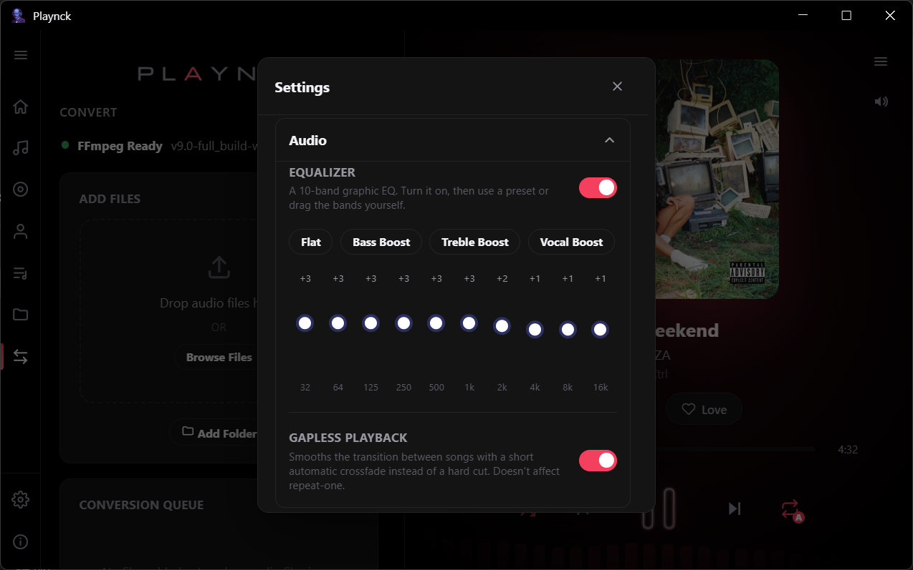</p>

### 🏷️ Metadata that actually writes back to the file
This is the feature that gets the most engineering attention in the codebase, and it shows:
- Edit title, artist, album, genre, track number, and cover art, and Playnck writes it into the **real file on disk** — ID3 tags via `node-id3` for MP3, FFmpeg-backed tagging for everything else — then re-reads the file to verify the write actually landed.
- Windows loves to lock files that are mid-playback, so before any rename/write, Playnck **detaches the audio element from the file, performs the write, and re-attaches it**, seeking back to the exact playback position.
- If a write still hits `EPERM`/`EBUSY`/`EACCES` because something else has the handle open, it **retries with backoff** instead of silently failing or corrupting the tag.
- Cover art can be added, replaced, or pulled automatically (see Auto-Tag below).

### 🔎 Auto-Tag (audio fingerprinting)
For that folder of `Track 03.mp3` files with no metadata at all:
- Generates an **audio fingerprint** of the file using a bundled Chromaprint (`fpcalc`) binary.
- Looks the fingerprint up against **AcoustID**, falls back to a text-based **MusicBrainz** search if there's no fingerprint match, and pulls cover art from the **Cover Art Archive**.
- Shows you the match before writing anything, so you're never surprised by an auto-tag result.

### 🎤 Synced lyrics
- Fetches time-synced (LRC-format) lyrics from lrclib.net and highlights the current line in real time as the track plays, over a blurred version of the album art.
- Lyrics are cached locally so repeat plays don't re-fetch, and you can nudge the sync offset if a particular file's timing is slightly off.

### 🎨 Deep personalization
- **6 background themes × 12 accent colors** — 72 total combinations — all switchable live from the swatch grid.
- The custom Windows title bar overlay recolors itself to match your theme automatically.
- English and French UI translations out of the box.

<p align="center">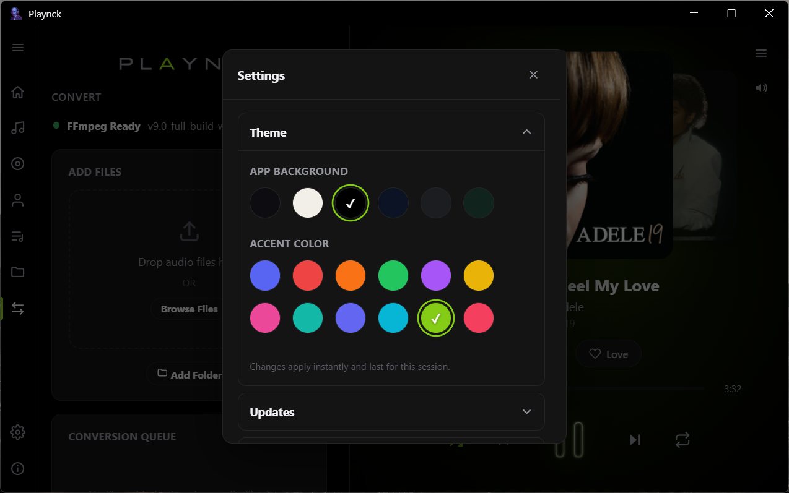</p>

### 🔁 Format conversion studio
- A dedicated **Convert** tab batches files or whole folders through a bundled FFmpeg install.
- Converts to **MP3, AAC, Opus, FLAC, ALAC, or WAV**, correctly marking which targets are lossless and which support embedded cover art.
- FFmpeg installs itself on first use via `winget` — no separate download-and-PATH dance for the user.

<p align="center">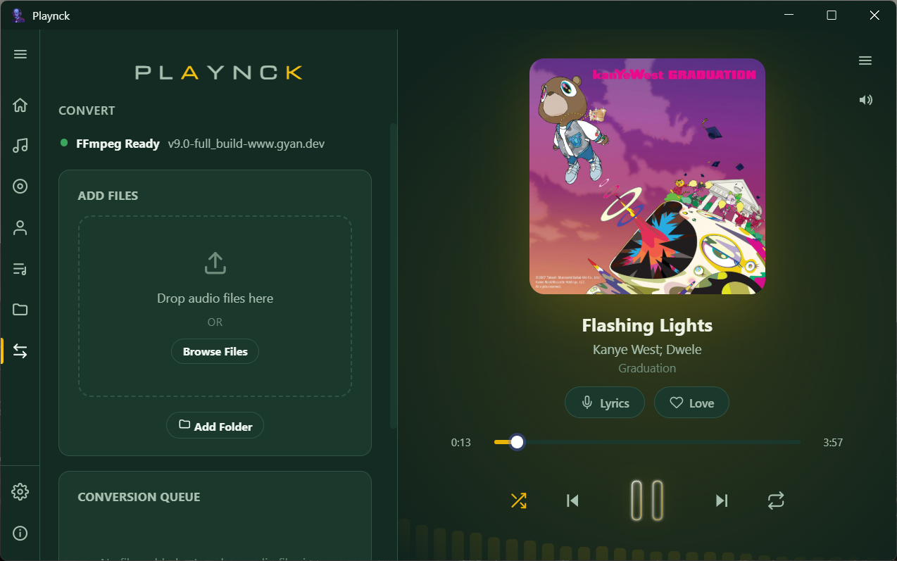</p>

### ⚙️ Settings, all in one place
Everything above is configurable from a single Settings panel, organized into **Theme, Updates, Audio, Player, Backup & Restore, and Language** — no digging through nested menus to find a toggle.

<p align="center">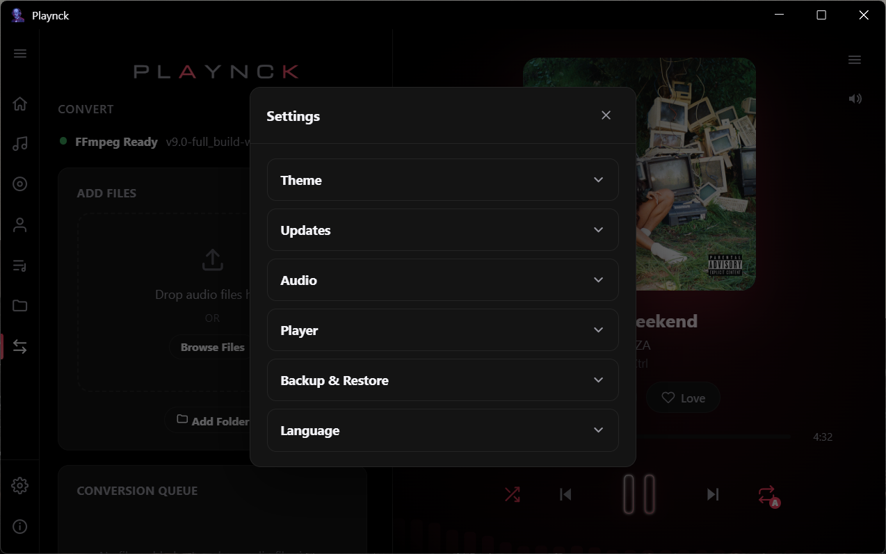</p>

### 🛡️ Reliability & housekeeping
- Optional **sleep timer** (15/30/45/60/90 minutes) that fades out and stops playback.
- **Backup & Restore** built into Settings, so your library/tags/preferences aren't stranded on one machine.
- Ships an EULA and third-party notices, with a locally vendored copy of `jsmediatags` and a strict Content-Security-Policy — the app doesn't reach out to arbitrary remote scripts.
- **Auto-updates** via `electron-updater`, checking Playnck's own GitHub Releases.

---

## 🧰 Tech stack

| Layer | What's used |
|---|---|
| Shell | Electron 43 |
| UI | Vanilla HTML/CSS/JS (no framework — hand-rolled rendering) |
| Metadata read | `music-metadata` |
| Metadata write | `node-id3` (MP3) + FFmpeg (everything else) |
| Fingerprinting | Chromaprint (`fpcalc`) → AcoustID → MusicBrainz → Cover Art Archive |
| Lyrics | lrclib.net |
| Auto-update | `electron-updater` + GitHub Releases |
| Packaging | `electron-builder` (NSIS installer) + `javascript-obfuscator` |

---

## 📦 Installation

Grab the latest Windows installer from the [**Releases**](https://github.com/FakharArrazi/Project-Playnck/releases/latest) page and run it. The installer lets you choose the install directory and creates Desktop + Start Menu shortcuts.

> Playnck currently ships as a **Windows-only** packaged build (NSIS installer, Windows-specific fingerprinting binary). The source itself is plain Electron and can be run in dev mode on other platforms, but there's no packaged macOS/Linux build yet.

## 🏗️ Building from source

```bash
git clone https://github.com/FakharArrazi/Project-Playnck.git
cd Project-Playnck
npm install

# Run in development
npm start

# Build a distributable installer
npm run build

# Build and publish a GitHub release (requires publish credentials)
npm run release
```

## ⚙️ Requirements

- Windows 10/11
- [Node.js](https://nodejs.org/) (current LTS) + npm, for building from source
- FFmpeg is **not** a manual prerequisite — the app installs it on demand via `winget` when you first use the Convert tab

---

## 📁 Project structure

```
Project-Playnck/
├── main.js                  # Electron main process — windows, IPC, protocols, updater
├── preload.js                # Context bridge between main and renderer
├── script.js                 # Renderer: UI, playback engine, EQ, visualizer, state
├── metadata-bridge.js          # Reads/writes ID3 & file metadata, EPERM retry logic
├── autotag-bridge.js           # Chromaprint fingerprinting → AcoustID/MusicBrainz
├── ffmpeg-bridge.js             # Format conversion pipeline
├── index.html / styles.css      # App shell and styling
├── build-scripts/               # Obfuscation + electron-builder release pipeline
├── resources/fpcalc/             # Bundled Chromaprint binary
├── docs/screenshots/              # README screenshots
├── LICENSE                       # End-user license agreement
└── THIRD-PARTY-NOTICES.txt       # Third-party attributions
```

---

## 💬 Community

Playnck ships with an in-app **About** screen — current build version, a short description of the app, and a one-click link to join the project's Telegram group for update announcements, feature requests, and support.

<p align="center">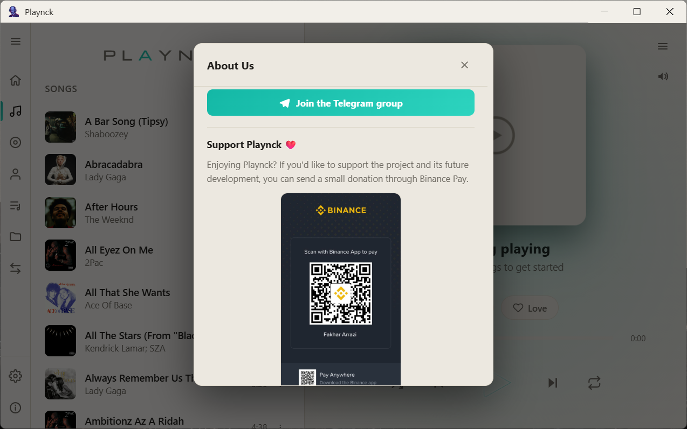</p>

## ❤️ Support Playnck

Enjoying Playnck? If you'd like to support the project and its future
development, you can donate through Binance Pay.

### Binance Pay

<p align="center">
  <a href="https://app.binance.com/uni-qr/5tLuirTT">
    
  </a>
</p>

<p align="center"><strong><a href="https://app.binance.com/uni-qr/5tLuirTT">Donate with Binance Pay</a></strong></p>

Scan the QR code or click the link above to make a donation.

## 🧑‍💻 Credits

Built and maintained by **[Arrazi](https://github.com/Arrazi-w140)**.

## 📄 License

Playnck is **source-available, not open source**. It's distributed under a custom End-User License Agreement (see [`LICENSE`](LICENSE)) — you're licensed to install and use the compiled app for personal/internal use, but redistribution, modification, and reverse engineering are restricted. See the LICENSE file for the full terms.

---

<div align="center">

If Playnck's your daily driver, a ⭐ on the repo goes a long way.

</div>
