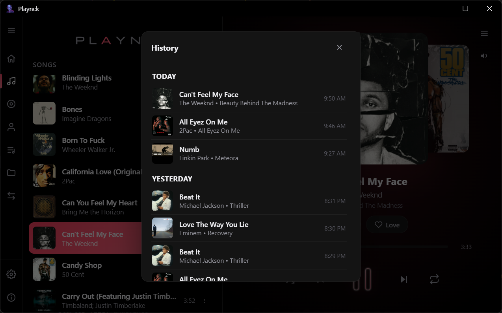

<div align="center">

# Playnck

**A local-first desktop music player for Windows and Linux that plays the files you already own, writes real tags back into them, and never asks you to sign in.**

Built with Electron. Writes real metadata back into your files. Fingerprints and auto-tags unsorted tracks. Ten-band equalizer. Synced lyrics. Seventy-two theme combinations. No cloud, no account, no subscription.

[](https://github.com/FakharArrazi/Project-Playnck/releases/latest)
[](https://github.com/FakharArrazi/Project-Playnck/releases)


[](#license)

</div>

---

## Contents

- [What Playnck Is](#what-playnck-is)
- [Why Playnck Exists](#why-playnck-exists)
- [Main Features](#main-features)
- [How It Works](#how-it-works)
- [Supported Platforms](#supported-platforms)
- [Supported Audio Formats](#supported-audio-formats)
- [Metadata and Automatic Tagging](#metadata-and-automatic-tagging)
- [Project Technology](#project-technology)
- [Installation](#installation)
- [Building From Source](#building-from-source)
- [Development](#development)
- [Project Structure](#project-structure)
- [Screenshots and Feature Demonstrations](#screenshots-and-feature-demonstrations)
  - [Home Dashboard and Now Playing](#home-dashboard-and-now-playing)
  - [Your Music Library](#your-music-library)
  - [Albums](#albums)
  - [Artists](#artists)
  - [Playlists and Nested Folders](#playlists-and-nested-folders)
  - [Watched Folders](#watched-folders)
  - [A Real Audio Engine](#a-real-audio-engine)
  - [Personalization and Themes](#personalization-and-themes)
  - [Format Conversion Studio](#format-conversion-studio)
  - [Synced Lyrics](#synced-lyrics)
  - [Listening History](#listening-history)
  - [Settings, All in One Place](#settings-all-in-one-place)
  - [About and Community](#about-and-community)
- [Keyboard Shortcuts](#keyboard-shortcuts)
- [Support the Project](#support-the-project)
- [Credits](#credits)
- [License](#license)

---

## What Playnck Is

Playnck is a free desktop music player for Windows and Linux, built with Electron. It plays the music you already have on your drive, whether that is a folder of neatly tagged FLACs or a messy pile of `Track 03.mp3` files with no metadata at all, and it presents that library the way you would expect from a modern player: a home dashboard, dedicated Songs, Albums, Artists, Playlists, and Folders views, a full playback engine with an equalizer and gapless-style crossfade, synced lyrics, batch format conversion, and metadata tools that can identify a track and write real tags back into the actual file.

There is no account to create, no subscription, and no cloud library. Your music stays exactly where it already lives, in plain files inside folders you control.

## Why Playnck Exists

Many desktop music players either lock your library behind a proprietary catalog, need an internet connection to do anything useful, or treat metadata editing as an afterthought your files never actually benefit from. Playnck was built around a different set of priorities.

Your files stay as files. Corrections you make (a fixed title, a properly spelled artist, an embedded cover) are written into the actual file on disk rather than hidden inside an app-only database, so they show up correctly the next time you open the same folder in any other player. Looking a track up online, whether to identify it or to fetch its lyrics, is something you choose to do from a button, not something that happens silently in the background. And because Playnck reads your files directly instead of importing them into a separate library format, there is no lengthy "import" step and no risk of your real files drifting out of sync with what the app thinks is in your library.

## Main Features

**Library and playback**
- A home dashboard with library stats, a Recently Played rail, and a Top Songs list ranked by genuine play count
- Browse by Songs, Albums, or Artists, with instant search and nine sort orders
- Shuffle with real history, three repeat modes, and a short automatic crossfade between tracks
- A ten-band equalizer with one-tap presets, plus operating-system media key and now-playing integration

**Organization**
- Playlists that can be nested inside folders to any depth, and a separate tab for watched music folders
- An automatically maintained Favorites playlist, updated with a tap of the heart button
- Multi-select for bulk deleting songs, albums, artists, folders, or playlists, or adding a whole selection to a playlist at once
- A ten-day listening history you can scroll back through and jump into

**Metadata and discovery**
- Two ways to auto-tag an unidentified track: audio fingerprinting through AcoustID, or a text search through MusicBrainz, each returning multiple candidate matches and cover art options to choose from
- Tag edits are written into the real file, not just into Playnck's own index
- Time-synced lyrics with a manual offset adjustment for tracks whose timing runs a little early or late

**Conversion and personalization**
- Batch conversion to MP3, AAC, Opus, FLAC, ALAC, or WAV, with per-format bitrate, compression, or bit-depth controls
- Six background themes crossed with twelve accent colors for seventy-two total combinations, plus a custom Now Playing background image
- A full English and French interface, with a JSON-based backup and restore for your whole library

## How It Works

Playnck does not import your music into a separate library format. When you add a song or a folder, Playnck reads the file directly and keeps a lightweight index of it (title, artist, album, duration, and so on) in a local database on your own machine, so the app can browse, search, and sort quickly. The audio itself is streamed straight from the original file on disk through a small local protocol built into the app, complete with proper HTTP range support, so seeking around inside a long track is instant.

Because the file on disk is always the source of truth, changes you make through Playnck (renaming a file, correcting its tags, adding cover art) change the real file rather than an entry that only exists inside the app. On launch, whenever the window regains focus, and roughly every ten minutes while Playnck is open, it quietly re-checks that every track it knows about still exists at its recorded path. Anything that has been moved, renamed outside the app, or deleted is pruned automatically, and any folders you are watching are re-scanned for files that were added or removed.

Playnck also runs entirely offline as far as your library is concerned: nothing about your files, your listening habits, or your tags is ever sent anywhere. The only features that reach out to the internet are the ones you trigger yourself, such as identifying a track with Auto-Tag or fetching lyrics for the current song, plus a periodic background check for app updates.

## Supported Platforms

- **Windows 10 and 11** (64-bit), distributed as an NSIS installer
- **Linux distributions built on RPM packages**, such as Fedora, RHEL-compatible systems, and openSUSE (64-bit only), distributed as a `.rpm` package

There is currently no macOS build.

## Supported Audio Formats

Playnck plays MP3, WAV, FLAC, OGG, M4A/AAC, Opus, and WebA files directly from disk. On Windows and Linux, Playnck also registers itself as an available opener for MP3, WAV, FLAC, OGG, and M4A files, so double-clicking one of those in your file manager can open it straight into Playnck.

Metadata write-back depends on the file's format:

| Format | Reads for browsing | Tags written back | Cover art embedding |
|---|---|---|---|
| MP3 | Yes | Yes (ID3, via `node-id3`) | Yes |
| FLAC | Yes | Yes (via FFmpeg) | Yes |
| M4A / AAC | Yes | Yes (via FFmpeg) | Yes |
| OGG | Yes | Yes (via FFmpeg) | No |
| Opus | Yes | Yes (via FFmpeg) | No |
| WAV | Yes | Yes (via FFmpeg) | No |

Writing tags to anything other than MP3 requires a working FFmpeg install, the same one the Convert tab uses. See [Metadata and Automatic Tagging](#metadata-and-automatic-tagging) below for how the write itself works.

The Convert tab targets a smaller, deliberately chosen set of output formats:

| Target | Type | Cover art on output | Adjustable setting |
|---|---|---|---|
| MP3 | Lossy | Yes | Bitrate (128 to 320 kbps) |
| AAC | Lossy | Yes | Bitrate (128 to 320 kbps) |
| Opus | Lossy | No | Bitrate (96 to 256 kbps) |
| FLAC | Lossless | Yes | Compression level |
| ALAC | Lossless | Yes | None |
| WAV | Lossless | No | Bit depth |

## Metadata and Automatic Tagging

This is the part of Playnck that gets the most attention, and it is built to actually change your files rather than just Playnck's opinion of them.

**Editing by hand.** Opening a track's Edit panel lets you correct its title, artist, and album, and add, replace, or remove its cover art. There is no separate "genre" or "track number" field to fill in; Playnck keeps things to the fields it can reliably identify and write back correctly.

**Identifying a track automatically.** For a folder full of untagged or mislabeled files, the same panel offers two lookup modes. "Identify from Audio" generates an audio fingerprint of the file using a bundled Chromaprint (`fpcalc`) binary and checks it against AcoustID. "Search by Title and Artist" runs a text search against MusicBrainz instead, and is also used automatically as a fallback whenever fingerprinting comes back empty. Either way, the lookup cleans up obvious junk in the existing filename or title (bracketed noise like "(Official Video)" or "(Lyrics)", for example) and skips over medley or bonus-track bundles that would otherwise produce a nonsense match. If more than one plausible match comes back, or more than one candidate cover art image is available from the Cover Art Archive, Playnck shows you the options so you can pick the right one instead of guessing on your behalf.

**Writing it back for real.** Once you save, Playnck writes the new title, artist, album, and cover art directly into the file: ID3 tags through `node-id3` for MP3, or a metadata-preserving remux through a locally available FFmpeg for FLAC, M4A, OGG, Opus, and WAV (cover art embedding is only supported for FLAC and M4A among that group). After writing, Playnck reads the file back to confirm the change actually landed before reporting success. Windows can lock a file that is mid-playback, so if the track you are editing is the one currently loaded, Playnck detaches it from the audio element first, performs the write, then reloads it and resumes at the exact same position. If a write fails because something else briefly has the file locked, Playnck retries with a short backoff instead of giving up immediately; if it genuinely cannot write to the file (a read-only location, or an unsupported format without FFmpeg available), it says so plainly and offers to at least update Playnck's own library entry so the app's view of the track stays correct. On a successful save, the file itself is renamed to an "Artist - Title" pattern to keep your folders tidy.

## Project Technology

| Layer | What's used |
|---|---|
| Application shell | Electron 43 |
| Interface | Vanilla HTML, CSS, and JavaScript (ES modules), no front-end framework |
| Local library index | IndexedDB (tracks, playlists, playlist folders, watched folders, lyrics cache, and settings) |
| Metadata reading | `music-metadata`, with a bundled `jsmediatags` fallback for files added without a resolvable file path |
| Metadata writing | `node-id3` for MP3, FFmpeg remuxing for FLAC, M4A, OGG, Opus, and WAV |
| Audio fingerprinting and lookup | Chromaprint (`fpcalc`) into AcoustID, with a MusicBrainz text-search fallback and cover art from the Cover Art Archive |
| Lyrics | lrclib.net |
| Audio engine | The Web Audio API (a `BiquadFilterNode` chain for the equalizer, an `AnalyserNode` for the visualizer) |
| Format conversion | FFmpeg, auto-installed on Windows via `winget`, expected on the system `PATH` on Linux |
| Auto-update | `electron-updater` against this repository's own GitHub Releases (Windows only) |
| Packaging | `electron-builder` (NSIS for Windows, RPM for Linux), with `javascript-obfuscator` applied to the shipped source |

## Installation

Grab the latest build for your platform from the [Releases](https://github.com/FakharArrazi/Project-Playnck/releases/latest) page.

### Windows

Run `Playnck Setup <version>.exe`. The installer lets you choose the install directory and creates Desktop and Start Menu shortcuts. Playnck checks for new versions automatically while it runs and can install them in-app.

### Linux (Fedora and other RPM-based distributions)

Download `playnck-<version>.x86_64.rpm` and install it with your package manager, for example on Fedora:

```bash
sudo dnf install ./playnck-<version>.x86_64.rpm
```

This installs Playnck under `/opt/Playnck`, adds it to your desktop environment's application launcher, and registers it as an opener for `.mp3`, `.wav`, `.flac`, `.ogg`, and `.m4a` files.

The primary target is a 64-bit Fedora or RHEL-compatible distribution, built and tested against that combination; other RPM-based distributions with the usual Electron runtime libraries available (`gtk3`, `libnotify`, `nss`, and similar) should also work.

Playnck on Linux does not auto-update in-app. An RPM installed system-wide under `/opt` is not something the app can safely overwrite itself while it is running, so updates are installed the same way as the original package: download the newer RPM from Releases and run `sudo dnf install ./playnck-<version>.x86_64.rpm` again, or `dnf upgrade` if you have added a repository that serves it. The in-app Settings > Updates button explains this and links back to the Releases page.

FFmpeg, used by the Convert tab and by tag writing for non-MP3 files, is not bundled for Linux. Playnck looks for `ffmpeg` on your `PATH` and tells you what is missing if it cannot find it. On Fedora, the official repository's `ffmpeg-free` package cannot encode MP3, since the patent-encumbered `libmp3lame` encoder is left out of it; enable [RPM Fusion](https://rpmfusion.org/) first if you want the full build:

```bash
sudo dnf install https://mirrors.rpmfusion.org/free/fedora/rpmfusion-free-release-$(rpm -E %fedora).noarch.rpm
sudo dnf install ffmpeg
```

Auto-Tag's audio fingerprinting works out of the box on Linux. A Linux `fpcalc` binary ships inside the RPM, so no separate Chromaprint install is needed.

## Building From Source

```bash
git clone https://github.com/FakharArrazi/Project-Playnck.git
cd Project-Playnck
npm install

# Run in development
npm start

# Build a distributable for your current OS
# (Windows produces an .exe installer, Linux produces a .rpm package)
npm run build

# Build and publish a GitHub release for your current OS
# (requires publish credentials)
npm run release
```

`npm run build` and `npm run release` always build for whichever operating system you run them on. There is no reliable way to cross-build a genuine Fedora RPM from Windows, or a trustworthy NSIS installer from Linux, so `electron-builder` is not asked to try. Building the Linux RPM specifically requires the `rpmbuild` tool (`sudo dnf install rpm-build` on Fedora, `sudo apt-get install rpm` on Debian and Ubuntu).

Official releases covering both platforms are built by [`.github/workflows/release.yml`](.github/workflows/release.yml): a Windows runner builds the installer, a Linux runner builds the RPM, and a final job combines both into a single GitHub Release automatically. To cut a release, either push a `v<version>` tag matching the version in `package.json`, or run the Release workflow manually from this repository's Actions tab; no manual building, uploading, or release creation is needed. Running `npm run release` from a single machine still works for a single-platform release.

Both the Windows installer and the Linux RPM always share the same version number, read from `package.json`, so there is only ever one version to bump.

## Development

Playnck's renderer is plain ES modules with no build step in development; `npm start` launches the Electron shell directly against the source in this repository, so changes to the HTML, CSS, or renderer scripts can be tested by reloading the window. The main process (`main.js`), the preload bridge (`preload.js`), and the metadata, Auto-Tag, and FFmpeg bridges each run in Node's context and talk to the renderer over Electron's IPC.

Requirements for building from source, on either platform:

- [Node.js](https://nodejs.org/) (current LTS) and npm
- Building the Linux RPM specifically also needs `rpmbuild` on your `PATH`

Packaged builds run the renderer and Node-side source through `javascript-obfuscator` as part of `npm run build`; this only affects the shipped output; nothing about running from source in development is obfuscated.

## Project Structure

```
Project-Playnck/
├── main.js                       Electron main process: windows, IPC, protocols, the updater
├── preload.js                    Context bridge between the main and renderer processes
├── script.js                     Renderer entry point that loads every module in script/
├── renderer-bridge.js            Media key and OS now-playing (Media Session) integration
├── player-marquee.js             Auto-scrolling marquee for long track titles
├── theme-boot.js                 Applies the cached theme before the main script loads
├── metadata-bridge.js            Reads and writes ID3/file metadata, with lock-retry logic
├── autotag-bridge.js             Chromaprint fingerprinting into AcoustID and MusicBrainz
├── ffmpeg-bridge.js               Format conversion and FFmpeg-based tag writing
├── index.html / styles.css        Application shell and top-level styling
├── script/                       Renderer modules: playback, library, UI, and per-feature logic
│   ├── state.js                    Shared app state and IndexedDB helpers
│   ├── init.js                     Startup sequence and library hydration
│   ├── player.js / queue.js         Playback engine and shuffle/repeat queue
│   ├── crossfade.js / equalizer.js   Gapless crossfade and the ten-band EQ
│   ├── visualizer.js                Canvas frequency visualizer
│   ├── library-view.js              Songs/Albums/Artists rendering, search, and sort
│   ├── metadata.js / metadata-edit.js  Library ingestion and the Edit/Auto-Tag panel
│   ├── playlists.js / playlist-folders.js  Playlists, Favorites, and nested folders
│   ├── folders.js                   Watched music folders
│   ├── history.js                   Listening history
│   ├── lyrics.js                    Synced lyrics and offset adjustment
│   ├── convert.js                   The Convert tab
│   ├── settings.js / theme.js / backup.js  Settings panel, theming, and backup/restore
│   ├── sleep-timer.js               Sleep timer
│   └── i18n.js                      English/French translation strings
├── css/                           One stylesheet per UI area, imported from styles.css
├── vendor/                        Bundled jsmediatags fallback reader and app fonts
├── resources/fpcalc/               Bundled Chromaprint binaries (Windows and Linux)
├── resources/icons/linux/          Linux hicolor icon set
├── build-scripts/
│   ├── build.js                     npm run build / npm run release entry point
│   ├── publish-release.js           Combines the CI-built installer and RPM into one release
│   └── reconcile-github-release.js  Cleans up a split release if one ever occurs
├── .github/workflows/release.yml   Windows and Linux CI build and combined release
├── docs/screenshots/               README screenshots
├── LICENSE                        End-user license agreement
└── THIRD-PARTY-NOTICES.txt         Third-party attributions
```

## Screenshots and Feature Demonstrations

### Home Dashboard and Now Playing

The Home tab is a quick look at your library and your listening habits: a count of your songs, albums, and artists, a Recently Played rail, and a Top Songs list ranked by genuine play count. A track only counts toward that ranking once it has actually played for thirty continuous seconds, so a skip or an accidental click does not inflate the numbers.

The panel on the right, the Now Playing panel, is present no matter which tab you are on. The current track's cover art sits front and center with faded previews of the previous and next track's covers peeking in from either side, which slide smoothly into place whenever you skip forward or back. Long titles, artist names, or album names that do not fit on one line scroll gently in place rather than being cut off. From here you can open synced lyrics, favorite the track with an animated heart, scrub the progress bar, and control shuffle, previous, play or pause, next, and repeat (off, all, or one, shown with a small badge). A live, color-reactive visualizer runs along the bottom, taking its color from whichever accent you have chosen. Play, pause, and skip also work from your keyboard's media keys and from the operating system's own now-playing widget, since Playnck reports the current track through the standard Media Session API.

<p align="center">
  
</p>

### Your Music Library

The Songs tab is where you browse everything Playnck knows about, and it is built to stay fast even with a large library thanks to a virtualized list that only renders the rows currently on screen. A search icon opens an instant, debounced search box that filters by title, artist, or album; a target-style icon jumps the list straight to whichever track is currently playing and briefly highlights it; a sort icon offers nine orderings (title, artist, or duration in either direction, date added newest or oldest first, or track number); and a select icon turns on multi-select so you can delete or add several tracks, albums, artists, or folders to a playlist in one action.

Every track also has a details panel, opened from its menu, that lists its exact duration, folder, file name, file type, file size, bitrate (flagged as lossless where applicable), and the date it was added, useful for spotting a bad rip or confirming a file really is lossless. Add music by dragging files or whole folders onto the window, or from the Folders tab described below. Deleting a track sends the real file to your operating system's trash rather than removing it outright.

<p align="center">
  
</p>

### Albums

Tracks are grouped into albums automatically by matching album name and artist, shown as a cover-art grid pulled from whichever track in the album actually carries embedded artwork. Tapping an album filters the list down to just its tracks, sorted by track number by default so the album plays back in its intended order.

<p align="center">
  
</p>

### Artists

Every artist in your library appears in a flat, searchable list with a song count next to their name. Tapping an artist filters the view down to everything by them, the same way tapping an album does.

<p align="center">
  
</p>

### Playlists and Nested Folders

Playlists are created freely and can be organized into folders, and those folders can contain other folders to any depth you like, so a structure such as "Workout, Cardio, Running" is entirely possible. A playlist or folder's menu includes a Move To option that relocates it into a different folder, or back to the root, at any time.

A Favorites playlist is created automatically the first time you use Playnck and updates whenever you tap the heart button on the Now Playing panel, complete with a small animated flourish. Adding tracks to any playlist opens a searchable, sortable picker rather than making you scroll through your whole library. Any playlist can also be exported as a standard `.m3u8` file, with each line pointing at the real file on disk, so other players can read the same playlist.

<p align="center">
  
</p>

### Watched Folders

The Folders tab is where you add music to Playnck in bulk. "Add Songs" imports individual files, while "Add Folder" watches an entire folder, subfolders included, so Playnck can pick up new files added there later without you having to re-import anything by hand. Each watched folder can be renamed for display purposes, "forgotten" (removed from Playnck's library without touching the real files on your drive), or deleted outright, which also sends every file inside it to your system trash.

<p align="center">
  
</p>

### A Real Audio Engine

Playback runs through the Web Audio API rather than a bare audio element, which is what makes the equalizer and visualizer possible. The equalizer is a ten-band graphic EQ spanning 32 Hz to 16 kHz, off by default; turn it on and either tap a preset (Flat, Bass Boost, Treble Boost, or Vocal Boost) or drag any of the ten bands by hand within a range of plus or minus 12 dB, with changes applying instantly to whatever is currently playing.

Alongside it, a gapless playback toggle smooths the transition between tracks with a short automatic crossfade of around three seconds instead of a hard cut, and steps aside automatically when repeat-one is active so a looping track does not fade into itself.

<p align="center">
  
</p>

### Personalization and Themes

Playnck's appearance is built from six background shades, from a near-black Pitch Black through a light cream theme to a Deep Midnight Blue and a Forest Green, crossed with twelve accent colors, for seventy-two combinations in total. Every combination previews instantly as you click through the swatches and is remembered the next time you open the app; on Windows, the title bar itself recolors to match whatever you choose.

Separately, under Settings > Player, you can set your own image as the Now Playing background and control how much blur sits over it with a slider from 0 to 20 pixels, and adjust how strongly the audio visualizer reacts to the music.

<p align="center">
  
</p>

### Format Conversion Studio

The Convert tab batches files, or a whole folder of them, through FFmpeg. Before converting anything, Playnck checks for a working FFmpeg install: on Windows, if it is missing, Playnck offers to install it for you through `winget` and streams the install log live; on Linux, FFmpeg is expected to already be on your system, with the Installation section above covering the RPM Fusion note Fedora needs for MP3 encoding.

You can convert to MP3, AAC, Opus, FLAC, ALAC, or WAV, with controls that adapt to the format you pick: a bitrate slider for the lossy formats, a compression-level setting for FLAC, and a bit-depth choice for WAV. Choose an output folder (Playnck suggests a "Playnck Converted" folder under your Music folder by default) and decide what should happen if a file with the same name is already there: rename automatically, replace it, or skip it. A batch shows both a per-file and an overall progress bar while it runs, can be cancelled midway, and finishes with a short summary and a button that opens the output folder directly.

<p align="center">
  
</p>

### Synced Lyrics

Tapping Lyrics on the Now Playing panel fetches time-synced, LRC-format lyrics for the current track from lrclib.net and highlights the current line as the song plays, shown over a dimmed, blurred version of the album art. Lyrics are cached locally after the first fetch, so returning to a song you have already viewed lyrics for loads instantly.

If a particular file's timing runs a little early or late, the sync tool lets you nudge the offset in small steps of 10, 100, or 500 milliseconds at a time, or reset it back to zero, until the highlighted line lines up with what you are actually hearing. Playnck remembers the adjustment for that track.

<p align="center">
  
</p>

### Listening History

History keeps a running log of what you have actually listened to, grouped by day under headings like Today and Yesterday, with each entry showing the track, its artist and album, and the exact time it played. A track is only logged once it has played continuously for at least five seconds, so an accidental click will not clutter the list. Entries older than ten days are trimmed automatically, and tapping any entry jumps straight back into that track.

<p align="center">
  
</p>

### Settings, All in One Place

Every setting lives in a single panel, organized into six collapsible sections: Theme, Updates, Audio, Player, Backup and Restore, and Language.

Under Updates, Playnck checks its own GitHub Releases automatically while it runs on Windows (roughly every 45 minutes) and can download and install a new version for you in-app; on Linux, updates are installed by reinstalling the RPM package yourself, and the button here explains why and links to the Releases page. Under Backup and Restore, you can export your entire library (tracks, playlists, playlist folders, watched folders, lyrics, and settings) to a single JSON file, and import it again later on the same or a different machine; this backs up your library's structure and metadata rather than the audio files themselves, so the original files still need to exist at the paths recorded in the backup. Under Language, you can switch the interface between English and French, both built in from the start.

A Sleep Timer, opened from the same per-track menu as History, lets you choose 15, 30, 45, 60, or 90 minutes, after which playback simply pauses on its own, a small convenience for falling asleep to music without it running all night.

<p align="center">
  
</p>

### About and Community

Playnck's in-app About screen shows the exact build version you are running, alongside a one-click link to join the project's Telegram group for update announcements, feature requests, and support, plus a short note on supporting the project's continued development, covered in [Support the Project](#support-the-project) below.

<p align="center">
  
</p>

## Keyboard Shortcuts

These work anywhere in the app except while you are typing into a text field.

| Shortcut | Action |
|---|---|
| Space | Play or pause |
| M | Mute or unmute |
| Up / Down arrow | Volume up / down |
| Left / Right arrow | Seek back / forward 5 seconds |
| Ctrl + Left / Right arrow | Previous / next track |

## Support the Project

Enjoying Playnck? If you would like to support its continued development, you can donate through Binance Pay.

<p align="center">
  <a href="https://app.binance.com/uni-qr/5tLuirTT">
    
  </a>
</p>

<p align="center"><strong><a href="https://app.binance.com/uni-qr/5tLuirTT">Donate with Binance Pay</a></strong></p>

Scan the QR code or follow the link above to make a donation.

## Credits

Built and maintained by [Arrazi](https://github.com/Arrazi-w140).

Playnck also relies on a number of open-source packages; see [`THIRD-PARTY-NOTICES.txt`](THIRD-PARTY-NOTICES.txt) for the full list and their license texts.

## License

Playnck is source-available, not open source. It is distributed under a custom End-User License Agreement (see [`LICENSE`](LICENSE)): you are licensed to install and use the compiled application for personal or internal use, but redistribution, modification, and reverse engineering are restricted. See the LICENSE file for the complete terms.

---

<div align="center">

If Playnck is your daily driver, a star on the repository goes a long way.

</div>
