

# Playnck

> A modern desktop music player for managing, playing, organizing, and editing your local music library.

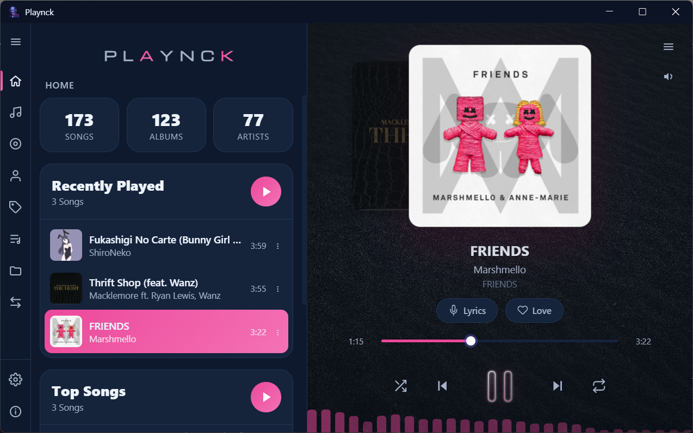

 

---

## What is Playnck?

Playnck is a desktop music player built around your local music library. It combines playback, library organization, metadata management, automatic tagging, synced lyrics, playlists, audio conversion, and deep customization in one app. No account, no subscription, no cloud.

## Features

- Browse by Songs, Albums, Artists, Genres, Playlists, and Folders
- Instant search, multiple sort orders, and multi-select
- Playlists with nested playlist folders, plus a Favorites playlist
- Listening history and a Home dashboard with your top songs
- Shuffle, repeat, and crossfade between tracks
- 10-band equalizer with presets and a live visualizer
- Sleep timer and media key support
- Full metadata editor with cover artwork, written into the real file
- Automatic tagging with audio fingerprinting and MusicBrainz lookup
- Synced lyrics with timing adjustment
- Batch audio converter
- 12 backgrounds and 18 accent colors
- Keyboard shortcuts
- Library backup and restore
- English and French interface

## Showcase

### Songs

Search, sort, and play your whole library. Open any track to see its file details.

<table>
  <tr>
    <td width="50%">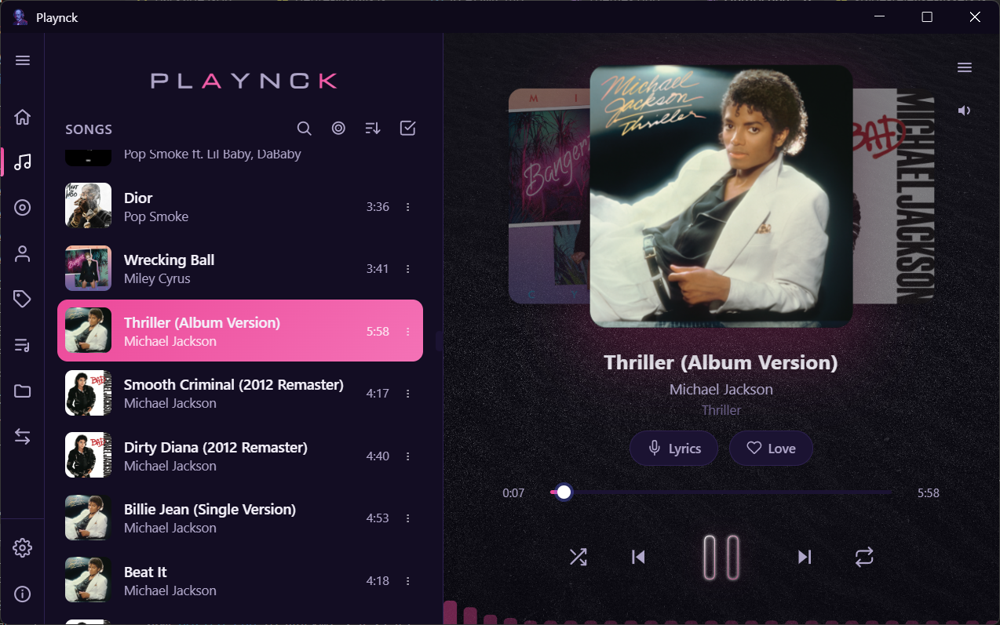</td>
    <td width="50%"></td>
  </tr>
</table>

### Albums

A cover art grid, and an album page with the full track list.

<table>
  <tr>
    <td width="50%">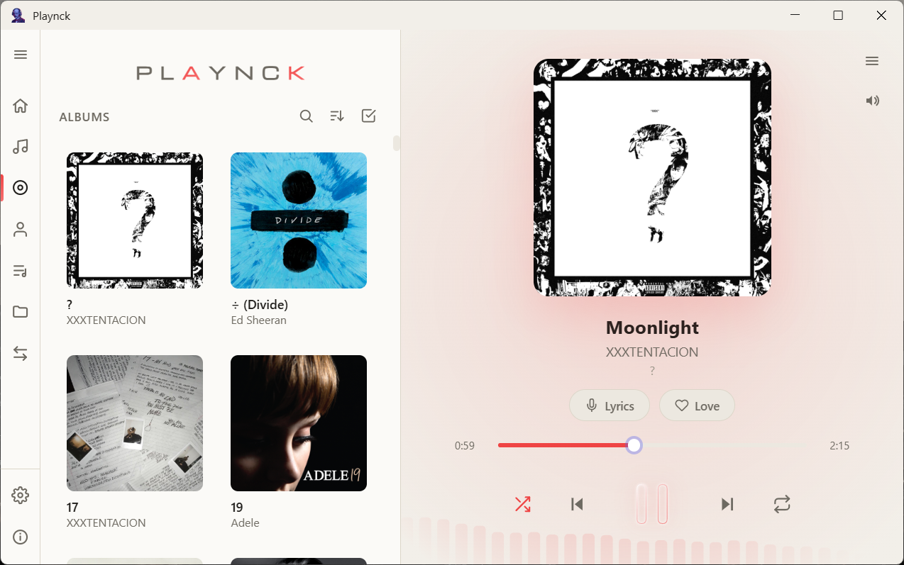</td>
    <td width="50%"></td>
  </tr>
</table>

### Artists

Every artist in your library, with their albums and songs on one page.

<table>
  <tr>
    <td width="50%">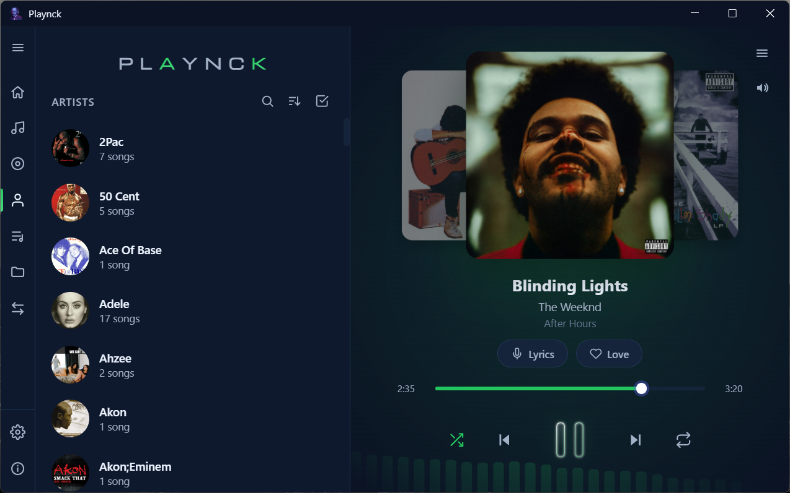</td>
    <td width="50%"></td>
  </tr>
</table>

### Genres

Your library grouped by genre.

  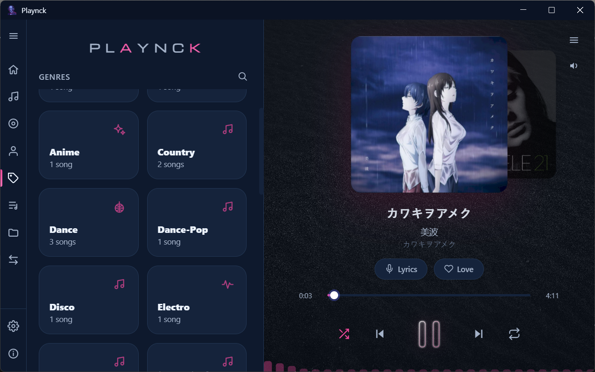

### Playlists

Create playlists, organize them into folders, and export them as `.m3u`.

  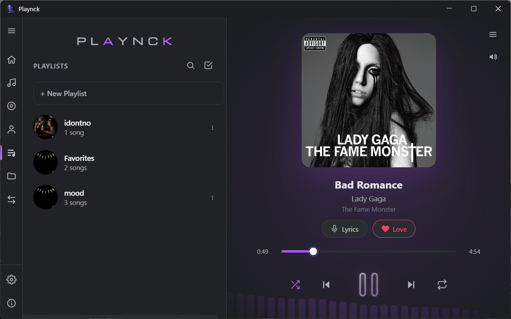

### Folders

Add songs or whole folders and keep them in sync with your drive.

  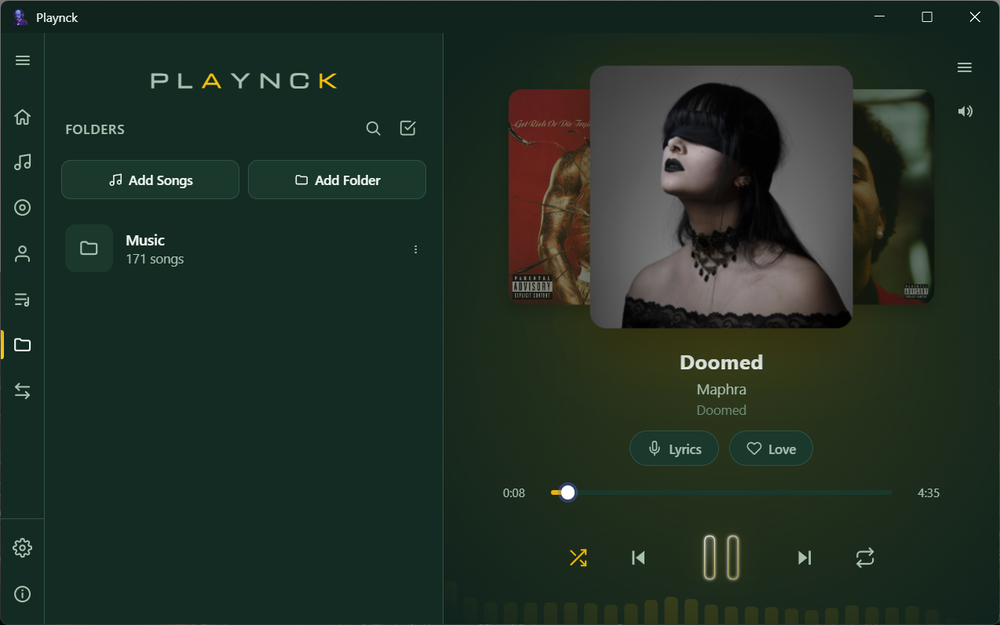

### Player

The Now Playing panel is always on screen. It has shuffle, repeat, favorites, lyrics, and a live visualizer.

- 10-band equalizer with Flat, Bass Boost, Treble Boost, and Vocal Boost presets
- Gapless playback with crossfade
- Sleep timer

<table>
  <tr>
    <td width="50%">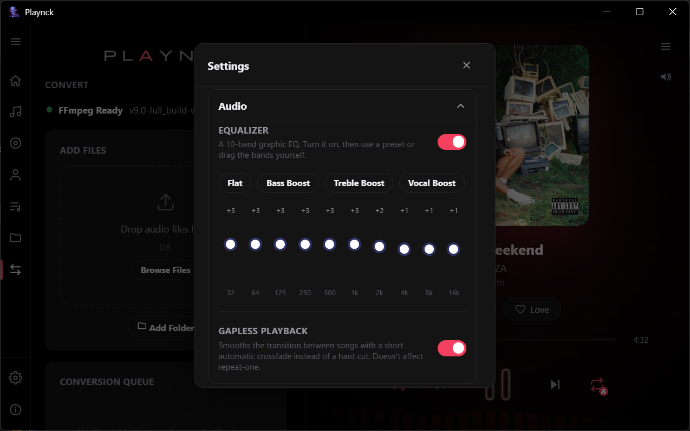</td>
    <td width="50%"></td>
  </tr>
</table>

### Listening History

Pick up where you left off, grouped by day.

  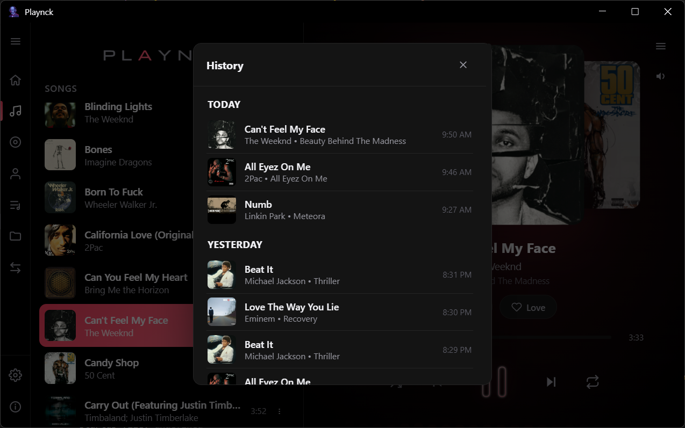

### Metadata Editor

Edit the metadata stored in your music files directly from Playnck.

- Title, artist, album, album artist, genre, release year and date
- Track and disc numbers
- Composer, lyricist, conductor, label, copyright, ISRC, BPM
- Grouping, subtitle, comment, lyrics
- Cover artwork

  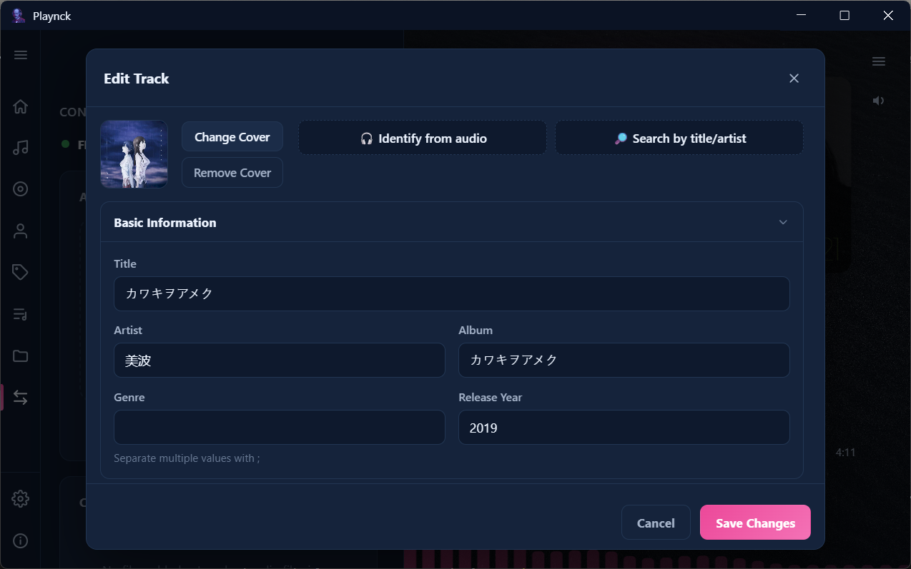

### Automatic Tagging

Open the Edit Track dialog and let Playnck find the metadata for you.

- Identify a track from its audio, or search by title and artist
- Compare the possible matches and pick the right one
- Apply the metadata and cover artwork

### Lyrics

Synced lyrics for the current song. Nudge the timing if a track runs early or late.

  

### Converter

Convert songs in batches. Drag and drop files or add a whole folder.

  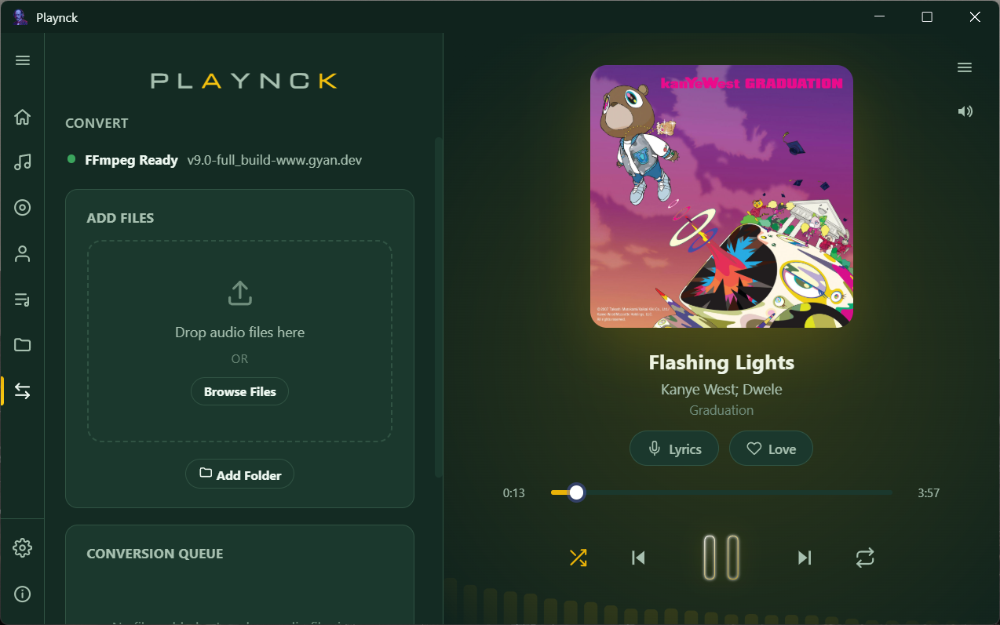

### Themes and Customization

12 backgrounds and 18 accent colors, remembered every time you open the app.

  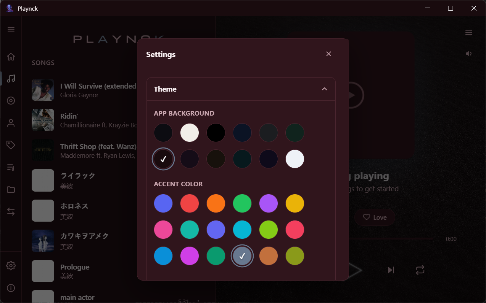

### Settings

Theme, updates, audio, player, keyboard shortcuts, backup and restore, and language, all in one place.

<table>
  <tr>
    <td width="50%">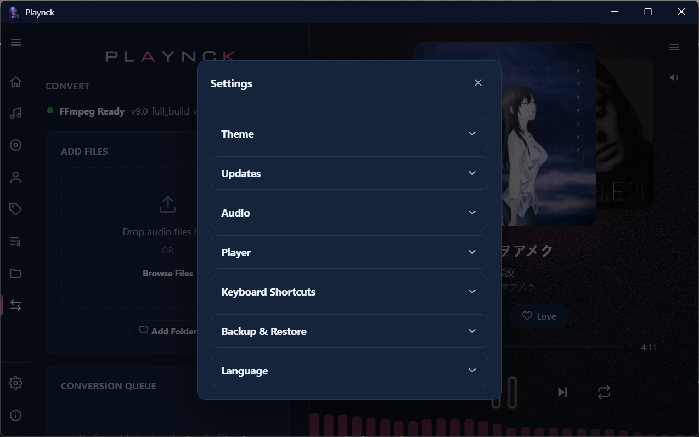</td>
    <td width="50%"></td>
  </tr>
</table>

## Supported Formats

**Playback:** MP3, WAV, FLAC, OGG, M4A, AAC, Opus, WebA

**Conversion:** MP3, AAC, FLAC, ALAC, WAV, Opus

## Platform Support

- Windows 10 and 11 (64-bit)
- Linux, 64-bit: `.rpm` for Fedora and other RPM-based distributions, `.deb` for Ubuntu, Debian, and other Debian-based distributions

## Download

Get the latest build from the [Releases page](https://github.com/FakharArrazi/Project-Playnck/releases/latest).

| Platform | File |
|---|---|
| Windows | `Playnck-Setup-<version>.exe` |
| Fedora and RPM-based Linux | `playnck-<version>.x86_64.rpm` |
| Ubuntu, Debian, and DEB-based Linux | `playnck_<version>_amd64.deb` |

The Converter needs FFmpeg. On Windows, Playnck offers to install it for you. On Linux, install `ffmpeg` from your package manager.

## Technology

- Electron
- JavaScript, HTML, and CSS
- IndexedDB
- Web Audio API
- FFmpeg
- Chromaprint and AcoustID
- MusicBrainz and Cover Art Archive
- lrclib

## Community

Join the [Telegram group](https://t.me/+taM7DL_CKsViNGM0) for updates and feature requests. You can also support development with [Binance Pay](https://app.binance.com/uni-qr/5tLuirTT).

## License

Playnck is released under the Playnck License. You may use, modify, fork, and share it, including for commercial use of your own work, but you may not sell Playnck or modified versions of it. See [`LICENSE`](LICENSE) for the full terms.

Third-party components keep their own licenses, listed in [`THIRD-PARTY-NOTICES.txt`](THIRD-PARTY-NOTICES.txt).

Built and maintained by [Arrazi](https://github.com/Arrazi-w140).
